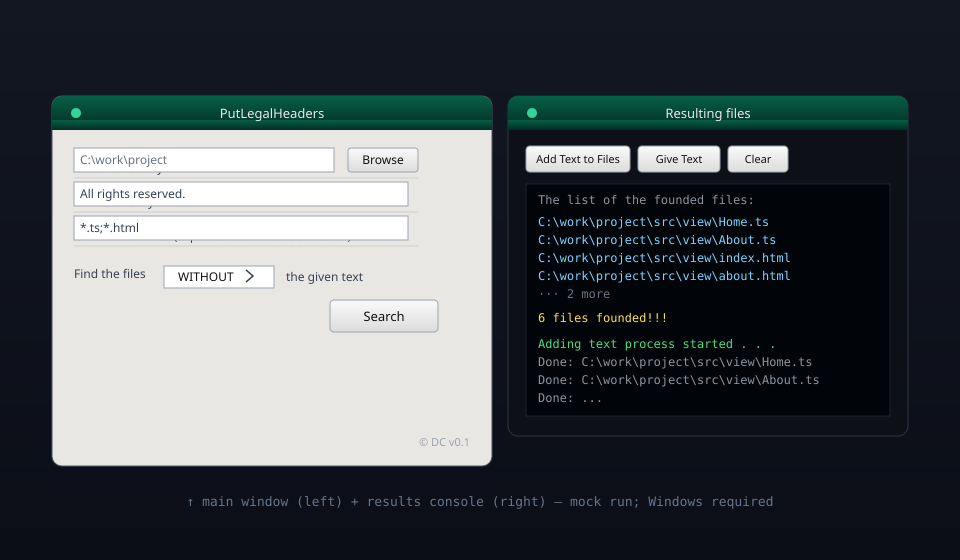

[](https://github.com/hmmaros/put-legal-headers-with-ui/actions/workflows/build.yml)


> **LEGACY · 2018** — Java 8 · Swing · Maven · Windows
>
> The GUI sibling of my [license-scanning CLI](https://github.com/hmmaros/put-legal-headers).
> Because a 2018 rule needed a 2018 window.

---

## The Story

The CLI version did its job so well that the next complaint arrived: *"How do I
use this thing without opening a terminal?"* So — because it was 2018 and that
was how things went — I gave `PutLegalHeaders` a face.

A Swing window, a folder picker, two text fields, one dropdown, a Search
button — and a second window that turned `System.out` into a live console. Type
a marker text like *"All rights reserved."*, pick `WITHOUT`, and it lists every
file still missing the license, ready to stamp with one click.

Hundreds of files, one button. The auditor smiled. The UI did its job, and it
never claimed to be pretty.

---

## At a glance

| The good | The honest truth |
| --- | --- |
| A real GUI: folder picker, fields, dropdown, Search | Result console hijacks `System.out`/`System.err` globally |
| Files *without* (`WITHOUT`) or *with* (`WITH`) the marker text | Discovery shells out to Windows `cmd.exe` |
| Semicolon-separated suffixes: `*.ts;*.html` | Creates `inputText.txt` + `tempFile.txt` on startup |
| Comment wrapping for `.html`, `.adoc`, and everything else | `json-simple` declared in `pom.xml` but never used! |
| UTF-8-safe header injection | No dry-run, no undo |



---

## Quick start

```bash
mvn clean package
java -jar target/PutLegalHeaders-1.0-jar-with-dependencies.jar
```

1. **Browse** for the folder to scan.
2. Type the **text to find** (e.g. `All rights reserved.`).
3. Type the **suffixes** (`*.ts;*.html`) — must start with `*.`.
4. Pick **WITH** or **WITHOUT**, press **Search**.
5. In the results window: **Give Text** to edit the header,
   **Add Text to Files** to stamp it into every listed file.

> The header is read from `inputText.txt` — edit it before clicking
> **Add Text to Files** (it ships with a sample to get you started).

---

## Retrospective: what I'd build differently today

- **A proper log view**, not a global `System.setOut/setErr` redirect that
  vanishes when the window closes.
- **`Files.walk` instead of `cmd.exe`** — portable discovery, no shell magic.
- **`SwingWorker` for the scan** — the UI would actually breathe while
  searching.
- **A layout manager that scales** instead of a single `mainPanel` bucket.
- **Dry-run + undo**, because "we rewrote those files" deserves a safety net.
- **Delete the unused `json-simple`** from the `pom.xml` — it was aspirational.

---

## Archived roadmap

- [x] Graphical folder scan + marker matching + one-click header insert (2018)
- [x] Live console window, HTML/AsciiDoc comment styles (2018)
- [ ] Cross-platform discovery — abandoned with the project
- [ ] Dry-run, undo, proper logging, removed dead dependency — never applied

*Status: kept as a legacy artefact; no active development.*

---

## Reference

- [Usage & screens](#usage--screens)
- [Comment styles](#comment-styles)
- [Project structure](#project-structure)
- [Logging](#logging)
- [Limitations](#limitations)
- [Contributing](#contributing)

### Usage & screens

**Main window**

- Folder picker (with Browse), text-to-find field, suffix field
  (`*.ts;*.html`, validated to contain `*.`), `WITH`/`WITHOUT` dropdown, and a
  **Search** button.

**Results window**

- Redirects `System.out`/`System.err` into a read-only text area so you watch
  discovery happen live, then:
  - **Add Text to Files** — prepends the header (from `inputText.txt`) to every
    listed file.
  - **Give Text** — opens `inputText.txt` for editing (Windows uses
    `cmd.exe start`).
  - **Clear** — clears the console.

### Comment styles

| File ends with | Wrapping |
| --- | --- |
| `.html` | `<!--` … `-->` |
| `.adoc` | `////` … `////` |
| everything else (e.g. `.java`, `.ts`) | `/*` … `*/` |

### Project structure

```
put-legal-headers-with-ui/
├── assets/                  # README artwork (header + mockup)
├── src/main/java/
│   ├── main/Main.java       # Entry point
│   ├── graphics/            # MainFrame, FileChooser, Input/SuffixTextField,
│   │                        #   OutputFrame (+ TextAreaOutputStream console)
│   ├── controller/
│   │   └── Functions.java   # File discovery + header insertion
│   ├── model/               # TextModel, PathsModel (search + directory state)
│   ├── finals/              # Finals (constants), Texts (labels/messages)
│   └── logger/MyLogger.java # Logging
├── inputText.txt            # Legal header text (created on startup)
└── pom.xml                  # Maven build (assembly → fat JAR)
```

> `tempFile.txt` is a runtime scratch file (git-ignored). Developer rules live
> in [AGENTS.md](AGENTS.md).

### Logging

`java.util.logging` writes to `%T/ReWarMe.log` — a filename inherited from its
dev-tool sibling `re-war-me`. It's a family thing.

### Limitations

- **Windows-only** — discovery requires `cmd.exe`; the "Give Text" editor
  shortcut assumes `cmd.exe start`.
- **No dry-run / no undo** — files are rewritten as soon as you click
  **Add Text to Files**.
- **Global console redirect** — `System.out`/`System.err` are captured by the
  results window; output is lost once it closes.
- **Unused dependency** — `json-simple` is declared but never imported.
- The `inputText.txt` sample header will be applied verbatim if you forget to
  edit it.

### Contributing

1. Fork and branch (`git checkout -b feature/your-feature`).
2. Follow [AGENTS.md](AGENTS.md): UI in `graphics`, logic in `controller`,
   state in `model`, strings in `Texts`/constants in `Finals`, no new
   dependencies.
3. Commit clearly, push, open a pull request.

---

## Part of the 2018 Toolbox

Three small experiments from the same era, kept for posterity:

| Repo | What it did |
| --- | --- |
| [**ReWarMe**](https://github.com/hmmaros/re-war-me) | WAR redeploy on autopilot |
| [**PutLegalHeaders**](https://github.com/hmmaros/put-legal-headers) | License-scanning CLI |
| **PutLegalHeaders (GUI)** | The same idea, with a face |

---

## Disclaimer

This tool **deletes and rewrites file contents** to insert headers. Only point
it at files you intend to modify, and test on a copy first. I'm not responsible
for data loss caused by running it.

---

## License

Released under the [MIT License](LICENSE) © 2018 hmmaros.